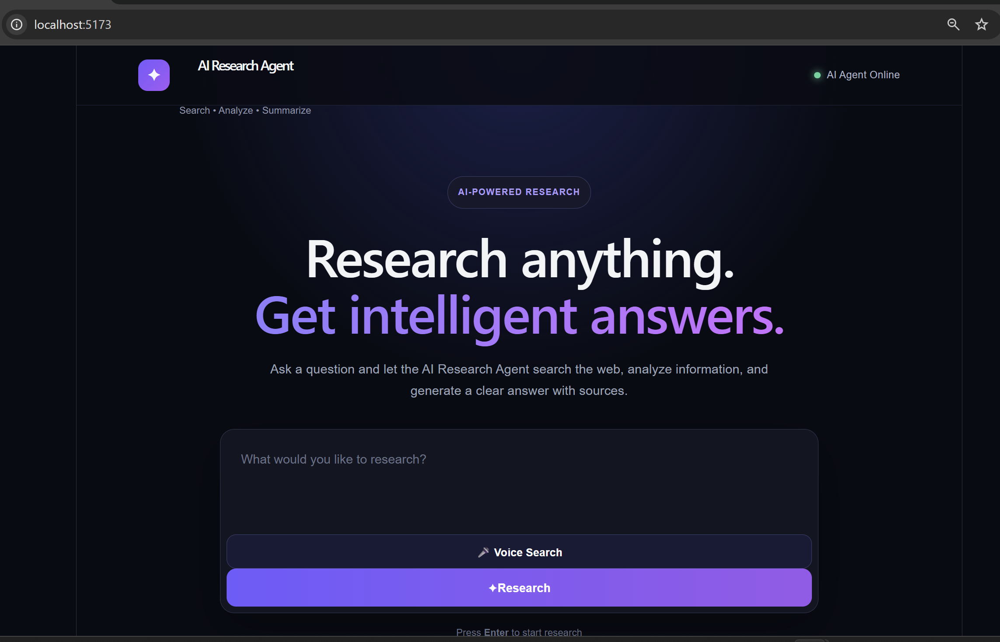
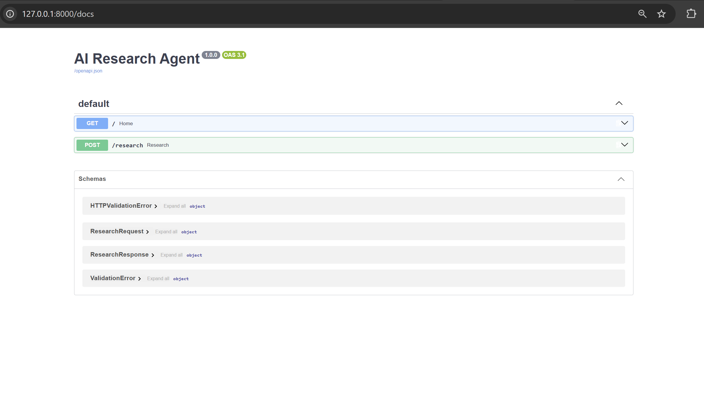

# AI Research Agent

An AI-powered research assistant that searches, analyzes, and summarizes information using a Python backend and React frontend.

## Features

- 🔎 AI-powered research and information search
- 🤖 Gemini API integration
- 🧠 AI-based analysis and summarization
- ⚡ FastAPI backend
- ⚛️ React + Vite frontend
- 🔐 API key stored securely using environment variables

## Tech Stack

### Backend
- Python
- FastAPI
- Google Gemini API

### Frontend
- React
- Vite
- JavaScript
- CSS

## Project Structure

```text
AI-Research-Agent/
├── backend/
│   └── app/
│       ├── main.py
│       ├── search.py
│       ├── .env
│       └── .env.example
├── frontend/
│   ├── src/
│   ├── public/
│   └── package.json
├── .gitignore
├── package.json
└── README.md
## How to Run

### Backend Setup

1. Create and activate the Python virtual environment:

```bash
python -m venv .venv
.venv\Scripts\activate
```
2. Install the backend dependencies:

```bash
pip install -r backend/requirements.txt
```

3. Create a `.env` file inside `backend/app` and add your Gemini API key:

```env
GEMINI_API_KEY=your_api_key_here
```

Do not upload or commit the actual `.env` file. The `.env.example` file is provided as a template.

### Frontend Setup

1. Open a new terminal and go to the frontend folder:

```bash
cd frontend
```

2. Install the frontend dependencies:

```bash
npm install
```

3. Start the frontend development server:

```bash
npm run dev
```

The terminal will display a local URL, usually:

http://localhost:5173

Open that URL in your browser to use the AI Research Agent.

### Backend Run

Open another terminal from the project root and run:

```bash
uvicorn backend.app.main:app --reload
```

The backend API will be available at:

http://127.0.0.1:8000

Swagger API documentation:

http://127.0.0.1:8000/docs

## Screenshots / Demo

### Application Interface



### API Documentation



> Screenshots demonstrate the working frontend and backend API.

## Future Improvements

- Add more advanced research and search capabilities
- Improve response accuracy and source handling
- Add user authentication and personalized research history
- Deploy the application for public access
- Add automated testing and improved error handling

## Author

**Suraj Auti**

AI Research Agent — AI-powered research assistant built using Python, FastAPI, React, Vite, and Google Gemini API.

